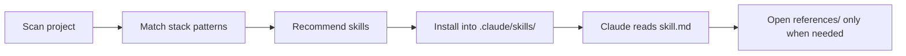

# Claude Skills for AI Builders

A plug-in library of Claude skills for coding, infra, security, docs, and multi-step agent workflows.

Use it to speed up project setup with reusable specialist prompts, install-by-detection, and a skill format Claude can discover directly from your repo.

[Quick start](#start-here-in-60-seconds) • [Browse skills](./.claude/skills/SKILLS_REGISTRY.md) • [See examples](./examples/README.md)

## Why AI builders care

- **38 reusable skills** covering build, infra, testing, security, docs, commerce, and orchestration workflows.
- **Project-aware recommendations** via `scripts/recommend_skills.sh`, which scans a repo and suggests the skills that fit its stack.
- **Progressive disclosure by design**: each skill starts with a short `skill.md` entrypoint and links out to deeper references only when needed.
- **Install and update flow included** with dry-run, interactive selection, profile export/import, and local update checks.

## Start here in 60 seconds

Clone the repo if you want the full catalog locally:

```bash
git clone https://github.com/daryllundy/claude-skills-library.git
cd claude-skills-library
```

Or run the recommender directly from the project you want to enhance:

```bash
curl -sSL https://raw.githubusercontent.com/daryllundy/claude-skills-library/main/scripts/recommend_skills.sh | bash
```

Preview recommendations without writing files:

```bash
bash scripts/recommend_skills.sh --dry-run
```

Install the recommended skills into the current project:

```bash
bash scripts/recommend_skills.sh
```

Migration note: `scripts/recommend_agents.sh` still works as a deprecated wrapper for now. Legacy `CLAUDE_AGENTS_*` env vars and the old `~/.cache/claude-agents` cache location are still honored during the transition, but new setups should use `CLAUDE_SKILLS_*` and `~/.cache/claude-skills-library`.

Example result for a repo with Docker, Kubernetes, Terraform, and GitHub Actions:

```text
Recommended skills:
  - docker-specialist
  - kubernetes-specialist
  - terraform-specialist
  - cicd-specialist
  - devops-orchestrator
```

## How it works



The repository ships canonical skill directories under `.claude/skills/`. Each one is structured for discovery first, depth second:

- `skill.md`: short entrypoint for automatic discovery
- `references/`: longer guidance and examples
- `scripts/`: helper automation stubs or utilities
- `assets/templates/`: reusable templates and artifacts
- `manifest.txt`: installer manifest for syncing the full skill directory

## What builders can do with it

**Ship infra**

```text
"Use the devops-orchestrator to coordinate Docker, Terraform, Kubernetes, and monitoring setup for this service."
```

**Audit security**

```text
"Use the security-specialist to review the authentication flow in src/auth/ and identify vulnerabilities."
```

**Generate tests**

```text
"Use the test-specialist to create unit and integration tests for the UserService class in src/services/user.service.ts."
```

**Design frontend**

```text
"Use the frontend-specialist to build a responsive dashboard component with React hooks and TypeScript."
```

**Coordinate a new API feature**

```text
"Use the architecture-specialist to design a REST API for user profile management, then hand implementation to scaffolding, database, test, and documentation specialists."
```

**Modernize legacy code**

```text
"Use the refactoring-specialist to modernize src/legacy/auth/ to async/await and then use the performance-specialist to validate regressions."
```

More prompt-shaped examples live in [examples/README.md](./examples/README.md).

## Featured workflows

**API feature workflow**

1. `architecture-specialist` designs the endpoint and data flow.
2. `scaffolding-specialist` creates the implementation structure.
3. `database-specialist` handles schema and query work.
4. `test-specialist` adds coverage for happy-path and failure cases.
5. `documentation-specialist` writes API docs.

**Production deployment workflow**

1. `docker-specialist` creates production-ready container assets.
2. `cicd-specialist` wires deployment automation.
3. `security-specialist` hardens the container and deployment posture.
4. `observability-specialist` adds monitoring and alerting.

**Code modernization workflow**

1. `code-review-specialist` identifies technical debt and risks.
2. `refactoring-specialist` modernizes the target module.
3. `test-specialist` adds regression coverage.
4. `performance-specialist` validates runtime impact.

## Popular skill categories

| Category | Examples |
| --- | --- |
| Build | `frontend-specialist`, `mobile-specialist`, `database-specialist`, `scaffolding-specialist` |
| Infra | `aws-specialist`, `azure-specialist`, `gcp-specialist`, `docker-specialist`, `kubernetes-specialist`, `terraform-specialist`, `cicd-specialist` |
| Quality | `code-review-specialist`, `security-specialist`, `test-specialist`, `performance-specialist`, `refactoring-specialist` |
| Commerce / Marketing | `shopify-specialist`, `web-design-specialist`, `instagram-specialist`, `tiktok-strategist`, `social-media-specialist`, `zapier-specialist` |
| Coordination | `devops-orchestrator`, `e-commerce-orchestrator`, `e-commerce-coordinator`, `architecture-specialist` |

Browse the full catalog in [`.claude/skills/SKILLS_REGISTRY.md`](./.claude/skills/SKILLS_REGISTRY.md).

## For contributors

Repository shape:

- `.claude/skills/`: canonical skill directories
- `.claude/skills/SKILLS_REGISTRY.md`: shipped skill catalog
- `scripts/recommend_skills.sh`: standalone recommender and installer CLI
- `data/agent_patterns.yaml`: detection rules used by the recommender

Contribution expectations:

- Keep `skill.md` under 200 lines and focused on discovery.
- Move detailed guidance into `references/` instead of growing the entrypoint.
- Preserve empty `scripts/` and `assets/templates/` folders with `.gitkeep`.
- Keep `manifest.txt` current when files are added or removed from a skill.

## Testing and limitations

Run the repository test suite with:

```bash
bash tests/run_all_tests.sh
```

This repo does **not** ship MCP servers or MCP tool implementations. If a skill references MCP-backed workflows, treat that as an external prerequisite already configured in the user environment.

The test suite covers detection logic, interactive selection, profile export/import, caching, and skill update flows.

Migration note: the legacy `.claude/agents/` surface is gone. The canonical format in this repo is `.claude/skills/{name}/`, with `skill.md` as the entrypoint and detailed material split into linked references.
